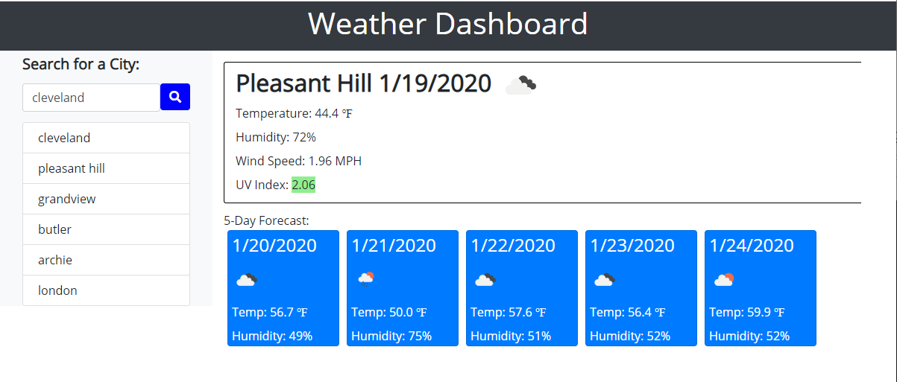

# Weather Dashboard
https://markspcs.github.io/homeworkWeek6/

## Description

This application launches with a with an empty view, and requires the user to search for a specific city. This relies on openweathermap.org api, so ONLY city can be searched. DO NOT include state or country

After clicking the search icon this app will present you with the current weather, and UV index. Below it will give you a 5 day forecast. 

Along the left side the app will save the recent searches you have done.

## Installation

Requires style.css , script.js, and index.html to be in the current working directory. 
    and
the ./images directory fully populated with all the png's outlined in openweathermap.org's api

## Credits

This program includes bootstrap from http://getbootstrap.com 
Also all weather information is from http://openweathermap.org

